<!-- This is the file displayed by the GitHub page, only put stuff that is ready to be public in here -->
# Team members
Ruijia Cao, Julia Grigni, Kurt Hu, Mah Tej Rella, and Scott Schaefer

# Proposal

[Video](https://www.youtube.com/watch?v=514thxIRxxM)

# Presentation
[Video](https://www.youtube.com/watch?v=zDNnnQ3TkIE)

## Introduction 

With the increasing digitization of financial infrastructure, the risk of fraudulent monetary transactions has soared. In this project, we are interested in detecting credit card fraud using machine learning techniques.  However, credit card fraud detection can be highly challenging due to the imbalance of legitimate and fraudulent transaction records within many publicly available datasets [1]. To tackle this problem, both supervised and unsupervised methods have been proposed and studied.  Popular supervised learning techniques generally focus on detecting potential fraud through classification of past individual transactions [2].  In contrast, unsupervised methods tend to focus on detection of anomalous patterns of financial accounts through clustering analysis [3]. 
Our dataset contains credit transactions made by European cardholders in September 2013 within a span of two days.

## Problem Definition
In a society where digital payments are quickly becoming the norm, everyone is at risk of becoming a victim of credit card fraud. Thus, it is vital for credit card companies to be able to recognize fraudulent transactions accurately in order to be able to respond quickly to shut down malicious users. In our project, we aim to create a model that takes in details of credit card transactions and outputs a prediction on the likelihood of whether or not the transaction was legitimate.

## Methods
We will start by cleaning the data and doing some preliminary exploration, such as importing and visualizing the data, exploring features and creating a correlation matrix, and investigating and employing conventional techniques to deal with imbalanced data. 

Then, we had planned to use Principal Component Analysis or Linear Descriminant Analysis to perform dimensionality reduction on our 28 features. However, as we learned more about PCA, we realized it would not be productive to apply PCA again on features that were already generated by PCA, such as our dataset.

Next, we will utilize supervised learning strategies, since our data is labeled, and we will compare the accuracy of different algorithms. We will perform a logistic regression and compare it to other options such as KNN and Naive Bayes. Then, we will utilize a random forest algorithm, and compare its effectiveness with a support vector machine. Finally, we will implement a neural network. 

## Potential Results & Discussion

We are trying to tackle an ongoing problem in this digital world: fraudulent transactions, specifically credit card transactions. Credit cards help us make purchases when we don’t have the amount readily available; however, cyber attackers can severely misuse this benefit. We want to develop a model to identify whether a transaction is normal or abnormal to stop this problem. The dataset we plan to use contains real bank transactions. However, the dataset doesn’t include all the key attributes (excluding time and amount) required to perform feature selection due to security concerns (the bank’s policies). Instead, it has features generated using PCA that will let us identify the transaction distribution using our model. The results will show the best approaches with the highest accuracy to be effectively used for fraud detection. 

## Timeline

## Data Preprocessing

In general, our data importing and preprocessing were very streamlined and minimal, since the data was “friendly”, or largely ready for use by ML algorithms. We only had to remove duplicates and convert the time from seconds to hours with a fractional component and center it at 0. This is because all features except amount and time were centered at 0 with smaller ranges, so we wanted to reduce the variance of the time column and center it. We did a similar process for the feature “amount”, centering it at 0 and scaling the standard deviation to 1. Then, after these relatively simple adjustments, the data was ready to use. Lastly, we removed outliers in our data set. There are multiple factors that contribute to our dataset being ready for use. First, the data is on Kaggle [4], which is used commonly in the field and thus has documentation in the community on how to import its data. Second, the data is all in one csv, which makes dealing with it easy by using pre-existing libraries such as the csv ready in pandas. Third, the data is all numeric (either ints or floats), which makes comparisons and distance evaluations between points much simpler. In addition to these factors that make the data “friendlier”, it is also worth noting that the data is already the result of PCA, with features in the new space created by PCA numbered by decreasing variance. This was done in order to protect consumers’ confidentiality by not having interpretable feature names, but it will be interesting to analyze how this element of preprocessing done by the database contributors will affect our results.

## Exploratory Data Analysis

### Imbalance

As we started working with and exploring the data, one of the first characteristics we noticed was how imbalanced the data is. 283253 points (99.833 %) of the data are non-fraudulent transactions, while only 473 points (0.167 %) of the data are fraudulent transactions. See the bar chart below for a visualization of this imbalance, where 0 represents legitimate transactions and 1 represents fraudulent transactions.

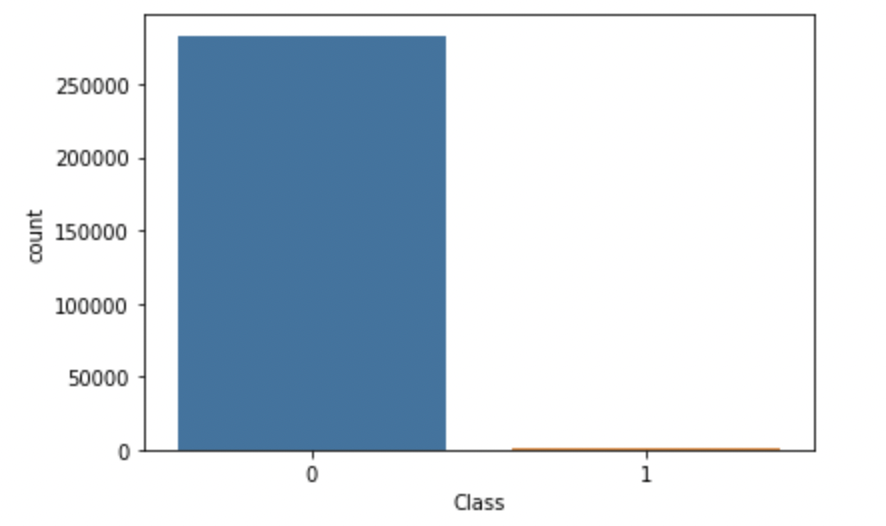

In many machine learning algorithms, imbalanced data can lead to a model that is less accurate for the minority class. So, we researched conventional techniques to address this issue.

### Combating Imbalanced Data
In our project, the vast majority of data points in the credit card dataset correspond to non-fraudulent transactions, which can lead to a deceptively high accuracy even if the smaller percentage of fraudulent transactions are not correctly predicted. Thus, when dealing with imbalanced data, accuracy is not the preferred performance metric. The following list contains preferred metrics for handling this type of data. [5]
- Confusion Matrix: A breakdown of predictions into a table showing correct predictions (the diagonal) and the types of incorrect predictions made (what classes incorrect predictions were assigned).
- Precision: A measure of a classifiers exactness.
- Recall: A measure of a classifiers completeness. [6]
- F1 Score (or F-score): A weighted average of precision and recall.
- Precision-Recall Curve: A plot containing precision and recall on the y and x axis, respectively, for different thresholds. [7]

#### Possible solutions
1. Undersampling the majority class (non-fraudulent transactions):
Undersampling the non-fraudulent transactions would help balance out the number of data points that are in each class, but at the cost of losing some data regarding the majority class. [8]

2. Oversampling the minority class (fraudulent transactions):
There are several oversampling techniques that can be employed to increase the number of data points in the minority graph artificially. The most popular of these methods is Synthetic Minority Oversampling Technique (SMOTE). This technique generates synthetic data points by selecting neighboring points and creating new samples in the line connecting those two points. [9]

So, we performed SMOTE on our dataset so that we would have balanced classes for our models to learn from, and after using SMOTE we had 283245 instances in each class.

### Preliminary Feature Exploration

Because our features are the result of PCA done by the database contributor and do not have useful names, we have to rely solely on our research and visualizations to contextualize them and determine their relationships to the problem we are trying to solve: detecting credit card fraud. While this is helpful in terms of eliminating bias we could have as researchers towards some features being more important, it also means we should take additional measures to visualize how features relate to our goal. So, we explored different features by computing their means for both classes: fraudulent transactions and non fraudulent transactions. We also computed the differences between these means, as a potential preliminary indicator or what features may be more useful or important for classification, though we will later use more formal approaches to dimensional reduction such as PCA instead of this, or to expand on these results.

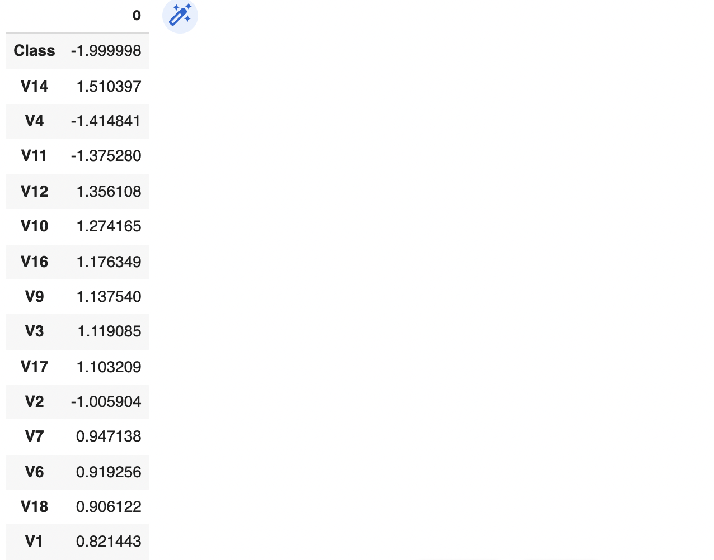

Above is a table of features against the calculation of their mean among legitimate transactions minus their mean among fraudulent transactions, divided by the standard deviation of that feature in the entire data set. We sorted the features by the absolute value of this metric, in descending order, and the image above displays the first several features, which may be more informative for our prediction. This is a preliminary metric to get a sense of how different the two classes are for each feature, standardized by the standard deviation of that feature, and could give us a sense of which features might have most predictive power: if there’s a large difference, then that feature might be more important in making our decision. It will be interesting to see how this intuition reflects other measures and algorithms to determine which features hold the most predictive power for our classification. The class variable is, of course, informative, but beyond that, the different PCA components’ value for this metric can give us an initial impression of their potential predictive power.

### Correlation Matrix

We continued to explore the features and their relationships through another visualization: the correlation matrix.

First, before using SMOTE, our correlation matrix reflects what we would expect of principal component data: that the principal components have a correlation of near zero with one another.

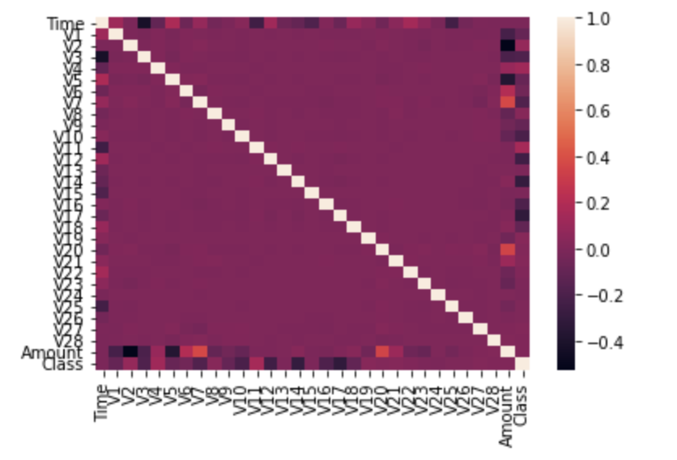

Next, we have the correlation matrix for the data we used to train our models, after applying SMOTE.

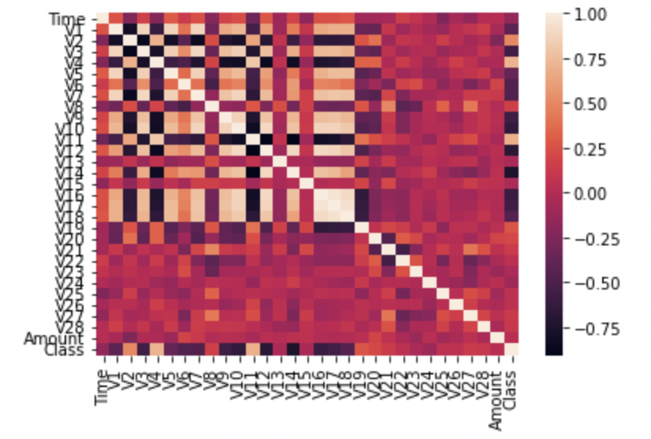

As shown in the correlation matrix above, there are many features that are correlated with one another to different degrees, though it appears that most of the significant correlations happen among V1 through V18. What is also informative is the correlation values for all other variables against “Class”, what we are trying to predict. Below, we have a list of the top few features by this metric, sorted in descending order based on the absolute value of their correlation with class:

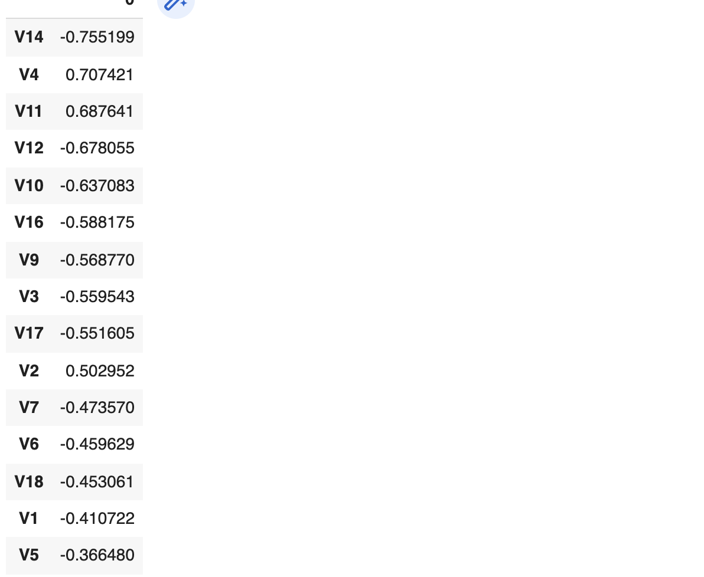

It is satisfying that the results here are the same order as the standardized mean difference we calculated previously (although here we excluded the correlation of 1 between class and itself). This means our preliminary data analysis strongly indicates that the features high in this list will be most useful for predicting the class values.

### Introduction to Dimensionality Reduction:
In this section, we will further explore data processing in the form of dimensionality reduction to make our machine learning models more efficient and to prevent possible overfitting. Dimensionality reduction is the process of removing features from our dataset while keeping as much information about the data as possible. In our project, we will utilize two techniques of dimensionality reduction and analyze them using forward selection with different supervised learning models. These two techniques are Principal Component Analysis (PCA) and correlation of features with respect to the class in decreasing order. The dataset that we found was already anonymized using PCA to protect privacy, and we sorted these features in the previous section by the features that had the highest absolute values for the correlation to the class. We will use these techniques alongside forward selection in our supervised learning models to analyze how many features are optimal for each learning technique and to see which type of dimensionality reduction is better for our project.

Here we can observe plots of the top two components of each respective technique.

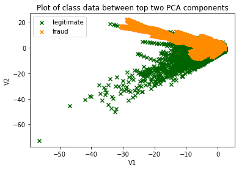

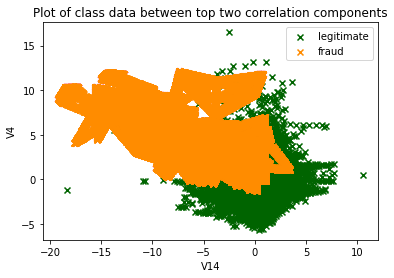

## Learning Techniques Methods with Results 

### Determining Accuracy:
In order to determine the effectiveness of our different supervised learning techniques alongside our dimensionality reduction techniques for each new feature added by forward selection, we used accuracy (with an 80:20 training/test split) and k-fold cross validation with 5 folds to look at how the accuracy changes based on the number of features for each technique. Cross validation is a technique used to measure the accuracy of an analysis and is more robust than accuracy in determining whether the model will generalize to other testing datasets.

### Naive Bayes:
The first supervised learning technique seen in our project is Gaussian Naive Bayes classification (GNB). GNB is a generative model that utilizes conditional probability alongside Bayes rule in order to classify data. 

After using Naive Bayes to classify the data and using cross validation and forward selection to record the accuracies of our analysis, the following chart resulted.

Our results suggest that correlation order is much more effective at lower feature numbers when compared to PCA. Both techniques utilizing Naive Bayes converged at about 91% accuracy at high feature counts, but correlation order had a peak accuracy at 3 features and 92.6% accuracy. This can be explained due to the Naive Bayes model overfitting as the number of features grows, which will lead to a decrease in the testing accuracy due to the model adapting to noise in the training data rather than generalizing.

### K-Nearest Neighbors (KNN):
The second supervised learning technique we looked at was k-nearest neighbors. KNN works by classifying data points based on the class of neighboring points, assigning objects to the class most common among the k nearest neighbors.

After using KNN for our data and using cross validation to determine accuracy, the following graph resulted when also using forward selection.

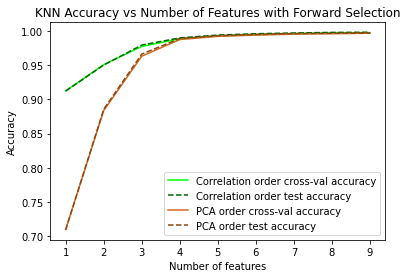

Again, correlation order outperforms PCA at lower feature counts, but both methods converge at around 4 features toward about 99.8% accuracy. It is surprising that the accuracy does not decrease after adding a large number of features, as KNN is notorious for overfitting, but this could be explained by the large size of the dataset being protective against overfitting.

### Logistic Regression:
Another machine learning supervised technique we used to analyze our data was logistic regression. Logistic regression models data after the logistic equation and is used in this case to classify data into two distinct groups (binary classification). It utilizes this equation to make predictions about input data.

After using logistic regression on our data and analyzing the accuracy using cross validation and forward selection, the following graph resulted.

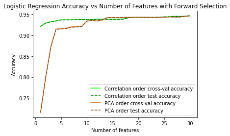

Correlation order once again outperforms PCA at lower features, but both methods seemed to converge to about 94.6% accuracy at high feature counts. PCA briefly outperformed correlation order at around 15 to 18 features. Just like with KNN, our logistic regression model does not seem to exhibit overfitting as the number of features increases, which also could be explained by the large size of the dataset being protective against overfitting.

### Neural Net:

Neural nets are another machine learning technique we utilized to analyze and model our dataset. This technique attempts to mimic how neurons work in the brain by using layers of nodes that try to “learn” and predict based on training data. This is extremely useful when trying to classify and categorize data, and such is our goal in predicting credit card fraud. 

In our project, we utilized Keras to build a neural net for our data. Since we have n >> d, that is, much more data than features, and our features are not pixels in an image or time-series data, we decided to use fully connected feed forward neural nets, and try different architectures (numbers of layers, which we call depth, and numbers of neurons in each layer, which we call width) to see how high the accuracy can become.

It is conventional to have hidden layers that are either all the same width or that decrease in width as we approach the output neuron. Furthermore, typical layer widths that we have encountered are at most either the number of input neurons (neurons_in) or the average of the number of input neurons and the number of output neurons(neurons_out).

Since this is binary classification, we planned to use a single output node with a sigmoid activation function. However, due to difficulties formatting the data that led to an error of encountering a loss that was constantly 0, we switched to using a one-hot encoding and an output layer with two nodes, each with a softmax activation function. Since this method is used for multiclass classification, it is also an option to use for binary classification. For the hidden layers, we used the 'relu' activation function, since it is the most conventional. We then trained the data over 50 epochs for each model, and created a plot of the resulting test accuracies. The plot can be seen below. 
We will denote a model's architecture as:
[input layer] - ( <hidden layer 1> - <hidden layer 2> ... ) - [output layer]

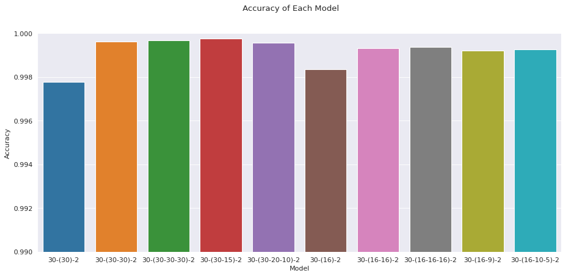

Accuracies across all of our neural network models were extremely high, all with accuracies exceeding roughly 0.998 accuracy (network with architecture 30 - (30) - 2 was roughly 0.9979). The neural network with architecture 30 - ( 30 - 15) - 2 had the best accuracy with roughly 0.9998 accuracy. This network's architecture is shown in the diagram below.

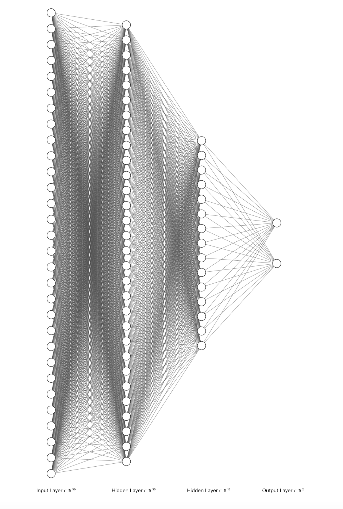

Also, it is worth noting that when we trained the models again we achieved the highest accuracy with a different network architecture. So, it’s not clear that there was a significant difference in the different architectures’ performances, though the networks with a single hidden layer seemed to have consistently worse accuracy. However, as a whole, neural networks performed very well on our data due to the high quantity of data points.

### Support Vector Machine

Moving onto our next technique, support vector machines are yet another way to classify data. This technique attempts to find a hyperplane based on the number of features in a dataset that classifies the data into distinct categories. A hyperplane is a subspace whose dimension is one lower than that of the space it is located in (e.g. a 1-D line in a 2-D coordinate plane). 

Our project utilized sklearn to perform the SVM technique. In order to tune our SVM model to achieve the best possible result, we attempted to optimize the model’s hyperparameters. 

The hyperparameters we want to optimize are:

**Cost (C)**: The penalty for each misclassified data point. A low value of C will lead to a decision boundary with a larger margin but more misclassification, while a high value of C will lead to a decision boundary with a smaller margin but less misclassified points.

**Kernel**: Using kernels are useful when the data cannot be linearly separated and transform the input from a low dimensional space to a higher dimensional space. Kernel types include rbf (radial basis function), linear, polynomial, and sigmoid.

**Gamma**: The gamma parameter controls the distance that training points can influence the decision boundary. When gamma is higher, points need to be very close to influence the decision boundary, and when gamma is lower, further away points are also considered.

To find the optimal hyperparameters, we will first determine the best kernel type to use by comparing the accuracies of different kernels. Within each kernel, we will further optimize cost (C), as well as other hyperparameters when applicable (degree for polynomial kernel, gamma for rbf kernel).

Below are the various charts detailing the investigation on finding the optimal hyperparameters of kernel, gamma, and cost.

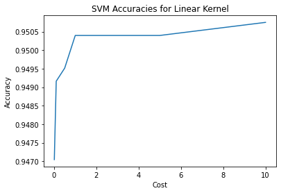
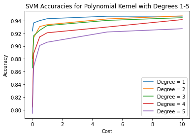
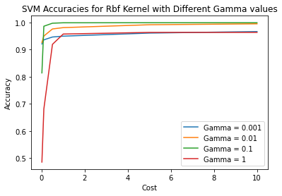
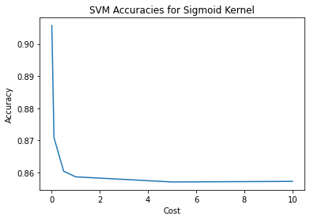

The rbf kernel performed the best out of all of the kernel types with a maximum accuracy of 99.89%. The linear and polynomial kernels both capped out at a max accuracy of about 95%, and the sigmoid kernel performed the worst with an accuracy of 90.57%. The general trend with cost was that accuracy increased as cost was increased from C=0.01 to C=1 but stagnated afterwards However, unlike the other kernels, the sigmoid kernel decreased in accuracy as the cost increased, with the highest accuracy at C=0.01.
Within the rbf kernel model, we varied both the gamma value and the cost to find the best hyperparameters. A gamma value of 0.1 displayed the highest accuracies, and increasing the cost beyond 1 had little benefit in the accuracy of the model.

### Random Forests
Random Forests is a classification algorithm that classifies objects by constructing a collection C of decision trees. Each decision tree model T in C runs on a subset S of the original dataset, where S is randomly sampled from the original dataset. The final output of the random forest is based on the plurality of the results of the models in C.

In our project, we use the RandomForestClassifier module from sklearn with the default hyperparameters. Our result is summarized as follows:
- Accuracy: 99.99%
- Precision: 99%
- Recall: 80%
- F1-Score: 89%
- Matthews Correlation: 82%

To further visualize the results, we give the confusion matrix of this model:

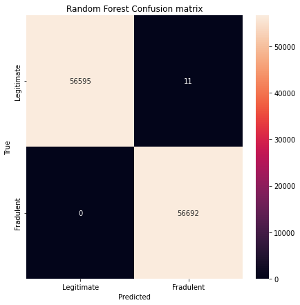

Due to the shear amount of data in our dataset, the Random Forests model performs relatively well.

## Conclusion

KNN seems to have by far the highest accuracy out of the 3 methods we tested with very high accuracy at low feature numbers. This method showed an accuracy of around 99% at around 4 features, especially when compared to the other methods. We suspect that the high accuracy of KNN is due to the distribution of fraudulent records within the original dataset. For example, if the distribution of fraudulent records within the dataset is particularly dense, then one can expect KNN to yield high accurary. Furthermore, it is also likely that the accuracy of KNN is aritficially inflated by SMOTE due to the addition of duplicated synthetic points within the minority class. 

Naive bayes peaked at only 92.6% accuracy at 3 features with correlation order, and was converging towards 91% accuracy at high feature counts with PCA and correlation order. Logistic regression performed slightly better than naive bayes with a 94.6% accuracy at high feature counts (>15).

The Neural Network model showed an accuracy of 99.9 %. We believe that the high accuracy of this model can be attributed to the shear quantity of data in our dataset. Hence, the model did not reveal any overfitting issues in the test set. The Random Forest model showed a similarly high accuracy of 99.9% and a precision rate of 99%. The final model explored in this project is SVM, which showed an accuracy of 99.98%. The effecitive performance of SVM is likely the result of the choice of the kernel function: we believe that the radial basis function used this project transforms the original dataset to a mostly linearly separable set. We summarize the accuracies of the various models in the plot below:

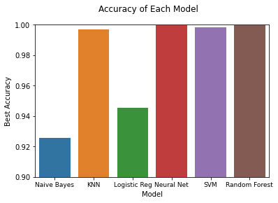

Furthermore, we show the the cross-entropy results as follows:

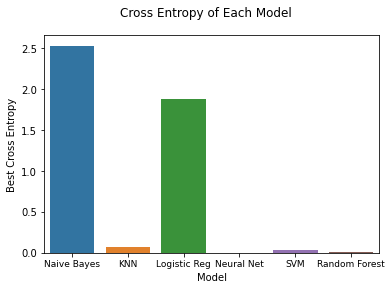

When looking at choosing the optimal feature counts, correlation order was generally the better choice compared to PCA when dealing with Naive Bayes, KNN, and logistic regression. It showed higher accuracy at low feature counts ( <4 features and >90% accuracy), especially compared to PCA (<4 features and mostly <90% accuracy). Using correlation order, it seems that around 3-4 features granted peak accuracy for all three techniques. 

In addition to analyzing the accuracy of these techniques with cross validation and cross-entropy, there are other ways of visualizing and analyzing the data, in addition to other curiosities that may be investigated further.

## Limitations and Future Extensions

As we mentioned with KNN above, some of our methods had their accuracies artificially inflated due to how we handled SMOTE. Because of SMOTE, we have the same (relatively) few fraudulent data points repeated many times over across our testing and training sets. So, when the model encounters a fraudulent data point during testing, there's a high chance that the 5 (k) closest neighbors will be duplicates of exactly the same original data point in the training data, which leads to an artificially high classification accuracy for fraudulent data in KNN with SMOTE.

In general, due to how we performed SMOTE before our train-test split, we encountered an issue: When looking solely at the fraudulent data points, we cannot distinguish between high accuracy and overfitting. This weakens the decisiveness of our results about which models performed best. We realized this weakness very late in our investigation, and if we had the chance to do the project again we would perform SMOTE on the testing and training set independently. It would be interesting to see how the results differ, and investigate whether there was overfitting we were not able to detect in our projects' results.

Some other interesting ideas that we had in mind for future extensions were performing cross entropy in addition to accuracy, visualizing more confusion matrices, and comparing performance with and without SMOTE. For example, we could compare the precision of our models to models trained without SMOTE on real-world, imbalanced data, in order to investigate whether using SMOTE is beneficial.

## References
[1] S. Dhankhad, E. Mohammed and B. Far, "Supervised Machine Learning Algorithms for Credit Card Fraudulent Transaction Detection: A Comparative Study," 2018 IEEE International Conference on Information Reuse and Integration (IRI), 2018, pp. 122-125, doi: 10.1109/IRI.2018.00025.

[2] Whitrow, Christopher, David J. Hand, Piotr Juszczak, David John Weston and Niall M. Adams. “Transaction aggregation as a strategy for credit card fraud detection.” Data Mining and Knowledge Discovery 18 (2008): 30-55.

[3] Bolton, Richard J. and David J. Hand. “Unsupervised Profiling Methods for Fraud Detection.” (2002).

[4] ULB, M. L. G.-. (2018, March 23). Credit Card Fraud Detection. Kaggle. Retrieved February 20, 2022, from https://www.kaggle.com/mlg-ulb/creditcardfraud

[5] J. Brownlee, “8 tactics to combat imbalanced classes in your machine learning dataset,” Machine Learning Mastery, 15-Aug-2020. [Online]. Available: https://machinelearningmastery.com/tactics-to-combat-imbalanced-classes-in-your-machine-learning-dataset/. [Accessed: 11-Mar-2022].

[6] “Precision and recall,” Wikipedia, 01-Feb-2022. [Online]. Available: https://en.wikipedia.org/wiki/Precision_and_recall#Definition_(classification_context). [Accessed: 11-Mar-2022].

[7] J. Brownlee, “How to use ROC curves and precision-recall curves for classification in Python,” Machine Learning Mastery, 12-Jan-2021. [Online]. Available: https://machinelearningmastery.com/roc-curves-and-precision-recall-curves-for-classification-in-python/. [Accessed: 11-Mar-2022].

[8] J. Brownlee, “Tour of data sampling methods for imbalanced classification,” Machine Learning Mastery, 14-Jan-2020. [Online]. Available: https://machinelearningmastery.com/data-sampling-methods-for-imbalanced-classification/. [Accessed: 11-Mar-2022].

[9] J. Brownlee, “Smote for imbalanced classification with python,” Machine Learning Mastery, 16-Mar-2021. [Online]. Available: https://machinelearningmastery.com/smote-oversampling-for-imbalanced-classification/. [Accessed: 11-Mar-2022]. 

